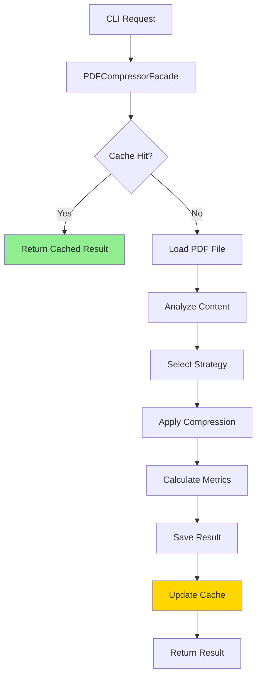

# 🏛️ Arquitetura do Sistema - CompactPDF

Documentação completa da arquitetura SOLID do sistema CompactPDF.

## 📋 Índice

1. [Visão Geral](#visão-geral)
2. [Principios SOLID](#princípios-solid)
3. [Patterns Utilizados](#patterns-utilizados)
4. [Camadas da Aplicação](#camadas-da-aplicação)
5. [Fluxo de Dados](#fluxo-de-dados)
6. [Componentes Principais](#componentes-principais)
7. [Diagramas de Arquitetura](#diagramas-de-arquitetura)
8. [Decisões Arquiteturais](#decisões-arquiteturais)

---

## 🌟 Visão Geral

O CompactPDF foi projetado seguindo rigorosamente os princípios SOLID, resultando em uma arquitetura modular, extensível e de fácil manutenção. O sistema utiliza múltiplos design patterns para garantir flexibilidade e reutilização de código.

### Características Arquiteturais

- **🎯 Modular:** Componentes independentes e intercambiáveis
- **🔄 Extensível:** Fácil adição de novas funcionalidades
- **🧪 Testável:** Alto grau de testabilidade e cobertura
- **⚡ Performante:** Otimizações de memória e cache
- **🔒 Confiável:** Tratamento robusto de erros e recuperação

---

## 🎯 Princípios SOLID

### **S** - Single Responsibility Principle

Cada classe possui uma única responsabilidade bem definida:

```
📁 Responsabilidades Bem Definidas:
├── PDFCompressorFacade     → Orquestração principal
├── ImageCompressionStrategy → Compressão de imagens apenas
├── FontOptimizationStrategy → Otimização de fontes apenas
├── CompressionCache        → Cache de resultados apenas
├── BackupManager          → Gerenciamento de backups apenas
└── CompressionAnalytics   → Analytics e métricas apenas
```

#### **Exemplo Prático:**
```python
# ✅ Responsabilidade única - apenas compressão de imagens
class ImageCompressionStrategy:
    def compress(self, pdf_data: bytes, config: CompressionConfig) -> CompressionResult:
        """Comprime apenas imagens do PDF."""
        pass

# ✅ Responsabilidade única - apenas métricas
class CompressionMetrics:
    def calculate_compression_ratio(self, original_size: int, compressed_size: int) -> float:
        """Calcula apenas taxa de compressão."""
        pass
```

### **O** - Open/Closed Principle

Sistema aberto para extensão, fechado para modificação:

```
🔧 Extensibilidade:
├── ICompressionStrategy (Interface)
│   ├── ImageCompressionStrategy     ✅ Implementação existente
│   ├── FontOptimizationStrategy     ✅ Implementação existente
│   ├── ContentOptimizationStrategy  ✅ Implementação existente
│   ├── AdaptiveCompressionStrategy  ✅ Implementação existente
│   └── NovaEstrategia              🆕 Extensão sem modificar core
│
└── ICompressionMetrics (Interface)
    ├── BasicMetrics                 ✅ Implementação existente
    └── AdvancedMetrics             🆕 Extensão sem modificar core
```

#### **Exemplo Prático:**
```python
# Nova estratégia sem modificar código existente
class AICompressionStrategy(ICompressionStrategy):
    def compress(self, pdf_data: bytes, config: CompressionConfig) -> CompressionResult:
        # Nova implementação usando IA
        pass
    
    def get_strategy_name(self) -> str:
        return "ai_compression"

# Registra automaticamente sem modificar PDFCompressorFacade
AVAILABLE_STRATEGIES['ai'] = AICompressionStrategy
```

### **L** - Liskov Substitution Principle

Implementações podem substituir interfaces sem quebrar funcionalidade:

```python
# Todas as estratégias são intercambiáveis
def compress_with_any_strategy(strategy: ICompressionStrategy, data: bytes) -> bytes:
    return strategy.compress(data, config)

# Funcionam identicamente
strategies = [
    ImageCompressionStrategy(),
    FontOptimizationStrategy(), 
    ContentOptimizationStrategy(),
    AdaptiveCompressionStrategy(),
    NovaEstrategia()  # Nova implementação
]

for strategy in strategies:
    result = compress_with_any_strategy(strategy, pdf_data)  # Sempre funciona
```

### **I** - Interface Segregation Principle

Interfaces específicas e focadas:

```
🔌 Interfaces Segregadas:
├── ICompressionStrategy     → Apenas estratégias de compressão
├── ICompressionMetrics     → Apenas cálculo de métricas
├── IProgressTracker        → Apenas tracking de progresso
├── ICompressionCache       → Apenas operações de cache
├── IBackupManager          → Apenas gerenciamento de backup
└── IPDFFileService         → Apenas operações com arquivos PDF
```

#### **Exemplo Prático:**
```python
# ✅ Interface específica e focada
class ICompressionStrategy(ABC):
    @abstractmethod
    def compress(self, pdf_data: bytes, config: CompressionConfig) -> CompressionResult:
        pass

# ✅ Interface específica para métricas
class ICompressionMetrics(ABC):
    @abstractmethod
    def calculate_compression_ratio(self, original_size: int, compressed_size: int) -> float:
        pass

# Classes implementam apenas o que precisam
class SimpleStrategy(ICompressionStrategy):
    # Implementa apenas compressão, não precisa de métricas
    pass
```

### **D** - Dependency Inversion Principle

Dependência de abstrações, não de implementações:

```python
class PDFCompressorFacade:
    def __init__(
        self,
        strategies: List[ICompressionStrategy],      # Abstração
        file_service: IPDFFileService,               # Abstração
        metrics_service: ICompressionMetrics,        # Abstração
        cache: ICompressionCache = None              # Abstração
    ):
        # Depende apenas de interfaces, não de implementações concretas
        self.strategies = strategies
        self.file_service = file_service
        self.metrics_service = metrics_service
        self.cache = cache
```

---

## 🎨 Patterns Utilizados

### **Facade Pattern** - Interface Simplificada

```python
# PDFCompressorFacade esconde complexidade interna
class PDFCompressorFacade:
    """
    Facade que simplifica uso do sistema complexo de compressão.
    Esconde detalhes de implementação do usuário final.
    """
    
    def compress_pdf(self, input_path: str, output_path: str) -> CompressionResult:
        # Orquestra internamente:
        # 1. Carregamento do arquivo
        # 2. Análise do conteúdo  
        # 3. Seleção de estratégias
        # 4. Aplicação de compressão
        # 5. Cálculo de métricas
        # 6. Salvamento do resultado
        pass
```

### **Strategy Pattern** - Algoritmos Intercambiáveis

```python
# Estratégias intercambiáveis em runtime
class CompressionContext:
    def __init__(self, strategy: ICompressionStrategy):
        self.strategy = strategy
    
    def set_strategy(self, strategy: ICompressionStrategy):
        self.strategy = strategy
    
    def compress(self, data: bytes) -> bytes:
        return self.strategy.compress(data)

# Uso dinâmico
context = CompressionContext(ImageCompressionStrategy())
result1 = context.compress(pdf_data)

context.set_strategy(FontOptimizationStrategy())
result2 = context.compress(pdf_data)
```

### **Factory Pattern** - Criação de Objetos

```python
class StrategyFactory:
    """Factory para criar estratégias baseado em configuração."""
    
    @staticmethod
    def create_strategy(strategy_type: str) -> ICompressionStrategy:
        strategies = {
            'image': ImageCompressionStrategy,
            'font': FontOptimizationStrategy,
            'content': ContentOptimizationStrategy,
            'adaptive': AdaptiveCompressionStrategy
        }
        
        strategy_class = strategies.get(strategy_type)
        if not strategy_class:
            raise ValueError(f"Estratégia {strategy_type} não encontrada")
        
        return strategy_class()

# Uso
strategy = StrategyFactory.create_strategy('adaptive')
```

### **Observer Pattern** - Notificações de Progresso

```python
class ProgressSubject:
    """Subject que notifica observers sobre progresso."""
    
    def __init__(self):
        self.observers: List[IProgressObserver] = []
    
    def attach(self, observer: IProgressObserver):
        self.observers.append(observer)
    
    def notify(self, progress: float, message: str):
        for observer in self.observers:
            observer.update(progress, message)

class ConsoleProgressObserver(IProgressObserver):
    """Observer que mostra progresso no console."""
    
    def update(self, progress: float, message: str):
        print(f"[{progress:.1%}] {message}")
```

### **Decorator Pattern** - Funcionalidades Adicionais

```python
class CachedCompressionStrategy:
    """Decorator que adiciona cache a qualquer estratégia."""
    
    def __init__(self, strategy: ICompressionStrategy, cache: ICompressionCache):
        self.strategy = strategy
        self.cache = cache
    
    def compress(self, pdf_data: bytes, config: CompressionConfig) -> CompressionResult:
        cache_key = self._generate_key(pdf_data, config)
        
        # Verificar cache
        cached_result = self.cache.get(cache_key)
        if cached_result:
            return cached_result
        
        # Executar estratégia original
        result = self.strategy.compress(pdf_data, config)
        
        # Salvar no cache
        self.cache.set(cache_key, result)
        
        return result
```

---

## 📚 Camadas da Aplicação

### **Apresentação** - Interface com Usuário
```
🖥️ Presentation Layer:
├── main.py                  → CLI interface
├── CompactPDFCLI           → Command line processor
└── ArgumentParser          → Command parsing
```

### **Fachada** - Simplificação de Acesso
```
🎭 Facade Layer:
└── PDFCompressorFacade     → Main orchestrator
```

### **Aplicação** - Lógica de Negócio
```
🏢 Application Layer:
├── CompressionOrchestrator  → Workflow management
├── StrategySelector        → Strategy selection logic
└── ResultAggregator        → Result compilation
```

### **Domínio** - Regras de Negócio
```
🏛️ Domain Layer:
├── Strategies/             → Compression algorithms
│   ├── ImageCompressionStrategy
│   ├── FontOptimizationStrategy
│   ├── ContentOptimizationStrategy
│   └── AdaptiveCompressionStrategy
│
└── Models/                 → Domain entities
    ├── CompressionResult
    ├── CompressionConfig
    └── PDFAnalysis
```

### **Serviços** - Operações Técnicas
```
🛠️ Service Layer:
├── PDFFileService          → File operations
├── CompressionMetricsService → Metrics calculation
├── ProgressTracker         → Progress tracking
└── QualityAnalyzer         → Quality assessment
```

### **Infraestrutura** - Recursos Externos
```
🔧 Infrastructure Layer:
├── CompressionCache        → Caching system
├── BackupManager          → Backup operations
├── CompressionAnalytics   → Analytics storage
├── SimpleLogger           → Logging system
└── MemoryOptimizer        → Memory management
```

---

## 🔄 Fluxo de Dados

### **Fluxo Principal de Compressão**

```
1. CLI Input
   ↓
2. PDFCompressorFacade
   ↓
3. PDFFileService.read_pdf()
   ↓
4. ContentAnalyzer.analyze()
   ↓
5. StrategySelector.select_optimal()
   ↓
6. Strategy.compress()
   ↓
7. CompressionMetrics.calculate()
   ↓
8. PDFFileService.write_pdf()
   ↓
9. CompressionResult
```

### **Fluxo Detalhado com Cache**



### **Fluxo de Processamento em Lote**

```
1. Batch Input Files
   ↓
2. For Each File:
   ├── Load PDF
   ├── Check Cache
   ├── Analyze Content
   ├── Select Strategy
   ├── Compress
   ├── Save Result
   └── Update Progress
   ↓
3. Aggregate Results
   ↓
4. Generate Report
```

---

## 🧱 Componentes Principais

### **PDFCompressorFacade** - Orquestrador Central

**Responsabilidades:**
- Coordenar todo o processo de compressão
- Gerenciar estratégias de compressão
- Integrar cache, backup e analytics
- Simplificar interface para o usuário

**Interfaces:**
```python
class PDFCompressorFacade:
    def compress_pdf(input_path, output_path, config) -> CompressionResult
    def compress_with_preset(input_path, output_path, preset) -> CompressionResult
    def batch_compress(input_patterns, output_dir, config) -> List[CompressionResult]
```

### **Estratégias de Compressão**

#### **ImageCompressionStrategy**
- **Foco:** Otimização de imagens
- **Técnicas:** Redimensionamento, recompressão JPEG, conversão de formato
- **Ideal para:** Catálogos, portfolios, documentos ricos em imagens

#### **FontOptimizationStrategy** 
- **Foco:** Otimização de fontes
- **Técnicas:** Subset de fontes, remoção de fontes não usadas, merge de fontes similares
- **Ideal para:** Documentos com muitas fontes, e-books, textos longos

#### **ContentOptimizationStrategy**
- **Foco:** Estrutura e conteúdo do PDF
- **Técnicas:** Remoção de objetos não usados, compressão de streams, otimização de estrutura
- **Ideal para:** PDFs gerados automaticamente, formulários, documentos técnicos

#### **AdaptiveCompressionStrategy**
- **Foco:** Seleção inteligente automática
- **Técnicas:** Análise de conteúdo, aplicação sequencial otimizada, machine learning
- **Ideal para:** Uso geral, documentos mistos, máxima eficiência

### **Serviços de Apoio**

#### **CompressionCache**
```python
class CompressionCache:
    def get(key: str) -> Optional[CompressionResult]
    def set(key: str, result: CompressionResult) -> None
    def clear() -> None
    def get_stats() -> CacheStats
```

#### **BackupManager**
```python
class BackupManager:
    def create_backup(file_path: str, description: str) -> str
    def restore_backup(backup_id: str, target_path: str) -> bool
    def list_backups() -> List[BackupInfo]
    def cleanup_old_backups() -> None
```

#### **CompressionAnalytics**
```python
class CompressionAnalytics:
    def record_operation(result: CompressionResult) -> None
    def generate_report() -> AnalyticsReport
    def get_performance_metrics() -> PerformanceMetrics
    def export_data(format: str) -> str
```

---

## 📊 Diagramas de Arquitetura

### **Diagrama de Componentes**

```
┌─────────────────────────────────────────────────────────────┐
│                        CLI Layer                            │
│  ┌─────────────────┐  ┌─────────────────┐                   │
│  │   main.py       │  │ CompactPDFCLI   │                   │
│  └─────────────────┘  └─────────────────┘                   │
└────────────────────────┬────────────────────────────────────┘
                         │
┌────────────────────────▼────────────────────────────────────┐
│                   Facade Layer                              │
│  ┌─────────────────────────────────────────────────────────┐ │
│  │           PDFCompressorFacade                           │ │
│  └─────────────────────────────────────────────────────────┘ │
└────────────────────────┬────────────────────────────────────┘
                         │
     ┌───────────────────┼───────────────────┐
     │                   │                   │
┌────▼──────┐    ┌──────▼──────┐    ┌──────▼──────┐
│Strategies │    │  Services   │    │    Utils    │
│           │    │             │    │             │
│ ┌───────┐ │    │ ┌─────────┐ │    │ ┌─────────┐ │
│ │Image  │ │    │ │PDFFile  │ │    │ │Cache    │ │
│ │Font   │ │    │ │Metrics  │ │    │ │Backup   │ │
│ │Content│ │    │ │Progress │ │    │ │Analytics│ │
│ │Adapt. │ │    │ │         │ │    │ │Logger   │ │
│ └───────┘ │    │ └─────────┘ │    │ └─────────┘ │
└───────────┘    └─────────────┘    └─────────────┘
```

### **Diagrama de Sequência - Compressão Básica**

```
User          CLI           Facade        Strategy      FileService    Metrics
│              │              │             │             │            │
│─────────────▶│              │             │             │            │
│ compress cmd │              │             │             │            │
│              │─────────────▶│             │             │            │
│              │ compress_pdf │             │             │            │
│              │              │────────────▶│             │            │
│              │              │ read_pdf    │             │            │
│              │              │◀────────────│             │            │
│              │              │ pdf_data    │             │            │
│              │              │─────────────▶│            │            │
│              │              │ compress     │            │            │
│              │              │◀─────────────│            │            │
│              │              │ compressed   │            │            │
│              │              │──────────────────────────▶│            │
│              │              │ write_pdf                 │            │
│              │              │◀──────────────────────────│            │
│              │              │ success                   │            │
│              │              │───────────────────────────────────────▶│
│              │              │ calculate_metrics                      │
│              │              │◀───────────────────────────────────────│
│              │              │ metrics                                │
│              │◀─────────────│             │             │            │
│              │ result       │             │             │            │
│◀─────────────│              │             │             │            │
│ display      │              │             │             │            │
```

### **Diagrama de Classes Principais**

```
┌─────────────────────────┐
│  PDFCompressorFacade   │
├─────────────────────────┤
│ + compress_pdf()        │
│ + batch_compress()      │
│ + compress_with_preset()│
└───────────┬─────────────┘
            │ uses
            ▼
┌─────────────────────────┐
│  ICompressionStrategy  │◀─────────────┐
├─────────────────────────┤              │
│ + compress()            │              │ implements
│ + get_strategy_name()   │              │
│ + can_handle()          │              │
└─────────────────────────┘              │
            ▲                            │
            │ implements                 │
            │                            │
┌───────────┴─────────────┐    ┌─────────┴─────────────┐
│ ImageCompressionStrategy│    │ FontOptimizationStrategy│
├─────────────────────────┤    ├─────────────────────────┤
│ + compress()            │    │ + compress()            │
│ + get_strategy_name()   │    │ + get_strategy_name()   │
└─────────────────────────┘    └─────────────────────────┘
```

---

## 🎯 Decisões Arquiteturais

### **Por que SOLID?**

**Benefícios Alcançados:**
- ✅ **Manutenibilidade:** Mudanças isoladas em componentes específicos
- ✅ **Testabilidade:** Cada componente pode ser testado independentemente
- ✅ **Extensibilidade:** Novas funcionalidades sem modificar código existente
- ✅ **Reutilização:** Componentes podem ser reutilizados em diferentes contextos
- ✅ **Legibilidade:** Código mais limpo e compreensível

### **Por que Strategy Pattern?**

**Justificativa:**
- PDFs têm conteúdos muito variados (imagens, texto, gráficos)
- Diferentes estratégias são eficazes para diferentes tipos de conteúdo
- Necessidade de escolher algoritmo em runtime baseado na análise
- Facilita adição de novas estratégias de compressão

**Alternativas Consideradas:**
- ❌ **If/Else gigante:** Difícil manutenção e extensão
- ❌ **Herança simples:** Não permite combinação de estratégias
- ✅ **Strategy Pattern:** Flexibilidade máxima e extensibilidade

### **Por que Facade Pattern?**

**Justificativa:**
- Sistema interno é complexo (múltiplas estratégias, cache, backup, analytics)
- Usuário final precisa de interface simples
- Facilita evolução interna sem quebrar API externa
- Permite diferentes interfaces (CLI, GUI, API) sobre mesmo core

### **Arquitetura de Cache**

**Decisão:** Cache inteligente com LRU e expiração
**Justificativa:**
- PDFs idênticos são frequentemente reprocessados
- Compressão é operação custosa computacionalmente
- Cache reduz significativamente tempo de resposta
- LRU evita crescimento descontrolado de memória

### **Sistema de Backup**

**Decisão:** Backup automático opcional
**Justificativa:**
- Compressão é operação destrutiva
- Usuários precisam de segurança para recuperar originais
- Backup automático reduz ansiedade e aumenta confiança
- Sistema de metadados facilita organização

### **Analytics Integrado**

**Decisão:** Sistema de analytics built-in
**Justificativa:**
- Dados de performance ajudam otimização contínua
- Métricas de qualidade permitem ajuste fino
- Relatórios ajudam usuários otimizar workflows
- Base para futura melhoria de algoritmos

### **Separação de Interfaces**

**Decisão:** Múltiplas interfaces específicas vs. uma interface geral
**Justificativa:**
- ISP (Interface Segregation Principle)
- Classes implementam apenas o que precisam
- Facilita testes e mocks
- Permite evolução independente de funcionalidades

---

## 🔮 Evolução da Arquitetura

### **Funcionalidades Futuras**

#### **Machine Learning Integration**
```python
class MLCompressionStrategy(ICompressionStrategy):
    """Estratégia que usa ML para otimização automática."""
    
    def __init__(self, model_path: str):
        self.model = load_ml_model(model_path)
    
    def compress(self, pdf_data: bytes, config: CompressionConfig) -> CompressionResult:
        # Análise usando ML
        features = self._extract_features(pdf_data)
        optimal_params = self.model.predict(features)
        
        # Aplicar parâmetros otimizados
        return self._compress_with_params(pdf_data, optimal_params)
```

#### **Plugin System**
```python
class PluginManager:
    """Gerenciador de plugins para extensões de terceiros."""
    
    def load_plugin(self, plugin_path: str) -> ICompressionStrategy:
        # Carregamento dinâmico de plugins
        pass
    
    def register_strategy(self, name: str, strategy_class: type):
        # Registro de novas estratégias
        pass
```

#### **Distributed Processing**
```python
class DistributedCompressionFacade(PDFCompressorFacade):
    """Facade para compressão distribuída."""
    
    def __init__(self, cluster_config: ClusterConfig):
        self.cluster = CompressionCluster(cluster_config)
    
    def batch_compress(self, files: List[str]) -> List[CompressionResult]:
        # Distribuir processamento entre nodes
        return self.cluster.parallel_compress(files)
```

### **Melhorias Planejadas**

1. **Performance**
   - Paralelização de estratégias
   - GPU acceleration para ML
   - Streaming para arquivos muito grandes

2. **Qualidade**
   - Métricas de qualidade mais sofisticadas
   - Comparação visual automática
   - Feedback loop para otimização

3. **Usabilidade**
   - Interface gráfica
   - API REST
   - Integração com cloud storage

4. **Monitoring**
   - Métricas em tempo real
   - Dashboard de performance
   - Alertas automáticos

---

*📝 Esta documentação da arquitetura é atualizada com cada mudança significativa no sistema.*
